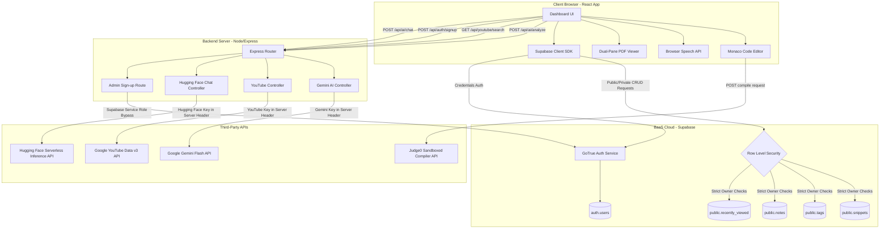
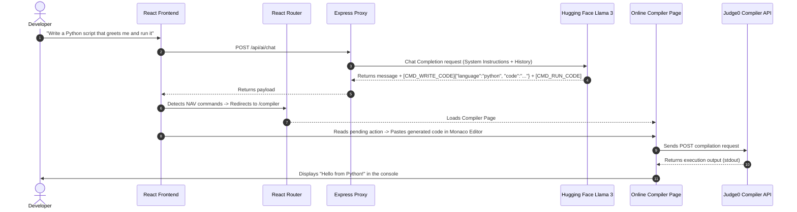

# <p align="center"><br/>🦾 CODEVAULT</p>

<p align="center">
  <strong>An industrial-grade, high-performance developer workspace and knowledge base. Securely organize code, automate intelligence, compile sandboxed code, and accelerate continuous learning.</strong>
</p>

<p align="center">
  
  
  
  
  
  
  
  
</p>

---

## 🏗️ System Architecture

CodeVault utilizes a hybrid **Serverless Direct + Secure Proxy API Gateway** architecture to isolate low-latency storage operations from key-bound server operations.



---

## 📋 Comprehensive Module Breakdown

### 1. Snippet Vault (Core Dashboard)
*   **Monaco Code Editor:** The editing engine powering VS Code is embedded directly, supporting 100+ programming languages.
*   **Snippet Management:** Easily save, update, delete, search, and stargate code snippets with tags, notes, and public/private accessibility configurations.
*   **Client Codebase:** [DashboardPage.tsx](file:///Users/apple/Desktop/PROJECTS/codevault-hackathon-starter_1/codevault/frontend/src/pages/DashboardPage.tsx)

### 2. Online Sandboxed Compiler
*   **Multi-language Sandbox:** Write and execute code instantly in **13 programming languages** (Java, Python, JavaScript, TypeScript, Go, Rust, C++, C#, PHP, Ruby, Swift, Kotlin, and Bash).
*   **Execution Backend:** Routes code compilation securely to the **Judge0 API** (`https://ce.judge0.com`), capturing stdout, stderr, and compiler outputs in real-time.
*   **Client Codebase:** [CompilerPage.tsx](file:///Users/apple/Desktop/PROJECTS/codevault-hackathon-starter_1/codevault/frontend/src/pages/CompilerPage.tsx)

### 3. CodeVault AI: Agentic Tutor
An advanced conversational assistant powered server-side by **Hugging Face Llama 3** (using `meta-llama/Meta-Llama-3-8B-Instruct`).
*   **Voice Typing & Output:** Integrates browser speech-to-text input dictation and text-to-speech output synthesis.
*   **UI Navigation Control:** The AI can dispatch client routing directives to navigate the user (e.g. `[NAV_COMPILER]`, `[NAV_VAULT]`).
*   **Agentic Code Writing:** Directs the compiler to pre-populate custom code structures using standard JSON payloads `[CMD_WRITE_CODE]`, and triggers automatic executions in the sandbox `[CMD_RUN_CODE]`.
*   **Client Codebase:** [AIChatbot.tsx](file:///Users/apple/Desktop/PROJECTS/codevault-hackathon-starter_1/codevault/frontend/src/components/AIChatbot.tsx) | **Backend Controller:** [ai.js](file:///Users/apple/Desktop/PROJECTS/codevault-hackathon-starter_1/codevault/backend/src/controllers/ai.js)

### 4. Learning Zone
*   **YouTube API Proxy:** Searches and lists coding tutorials distraction-free. The Express backend restricts queries to educational keywords to ensure focus.
*   **History Logs:** Stores watched playlist logs directly into the PostgreSQL database (`recently_viewed` table).
*   **Client Codebase:** [LearningZone.tsx](file:///Users/apple/Desktop/PROJECTS/codevault-hackathon-starter_1/codevault/frontend/src/pages/LearningZone.tsx) | **Backend Controller:** [youtube.js](file:///Users/apple/Desktop/PROJECTS/codevault-hackathon-starter_1/codevault/backend/src/controllers/youtube.js)

### 5. Document Vault
*   **Dual-Pane View:** Render design specification PDFs side-by-side with a persistent Markdown editor.
*   **Persistence:** Markdown notes sync dynamically to the Supabase database (`notes` table).
*   **Client Codebase:** [NotesPage.tsx](file:///Users/apple/Desktop/PROJECTS/codevault-hackathon-starter_1/codevault/frontend/src/pages/NotesPage.tsx)

### 6. Habit Streak Todo Tracker
*   **Sprint Cycles:** Manage 7-day checklist protocols to track dev momentum.
*   **Persistence:** Saved inside local storage alongside streak calculations.
*   **Client Codebase:** [TodoPage.tsx](file:///Users/apple/Desktop/PROJECTS/codevault-hackathon-starter_1/codevault/frontend/src/pages/TodoPage.tsx)

---

## 🔄 Interactive Agentic Flow
The diagram below illustrates how the **AI Chatbot** interacts dynamically with the **Online Compiler** to write and run code for the developer:



---

## 🔒 Security & Data Integrity Protocol
CodeVault enforces security directly in the database layer via **Row Level Security (RLS)** in [PRODUCTION_SCHEMA.sql](file:///Users/apple/Desktop/PROJECTS/codevault-hackathon-starter_1/codevault/PRODUCTION_SCHEMA.sql):

### Row Level Security Policies:
*   **public.snippets:** Accessible by any authenticated user for reading (enables the "Explore" dashboard). Mutating (INSERT, UPDATE, DELETE) is restricted to users whose `auth.uid() = user_id`.
*   **public.tags & public.notes:** Isolated per user. No cross-user access allowed.
*   **public.recently_viewed:** Locked down. Users can only fetch and update their own video logs.

### Anti-Spoofing Triggers:
Every database mutation in `snippets`, `tags`, `notes`, and `snippet_tags` fires the `handle_set_user_id` trigger before running. If the client tries to set a different `user_id` than their actual authenticated session UID (`auth.uid()`), the trigger throws an exception:
```sql
CREATE OR REPLACE FUNCTION public.handle_set_user_id()
RETURNS TRIGGER AS $$
BEGIN
  IF NEW.user_id IS NULL THEN
    NEW.user_id := auth.uid();
  ELSIF NEW.user_id != auth.uid() THEN
    RAISE EXCEPTION 'Unauthorized: Cannot set user_id to different user';
  END IF;
  RETURN NEW;
END;
$$ LANGUAGE plpgsql SECURITY DEFINER;
```

---

## 🚀 Installation & Local Launch

### 📋 Prerequisites
*   Node.js (v18.x or higher)
*   A free **Supabase** account
*   Google Gemini API Key
*   Hugging Face Access Token
*   YouTube Data v3 API Key

### 1. Project Setup
```bash
git clone https://github.com/jaggureddy11/Code-Vault.git
cd Code-Vault
npm run install:all
```

### 2. Database Sync
Go to your **Supabase Project Dashboard** → **SQL Editor** → Paste and run [PRODUCTION_SCHEMA.sql](file:///Users/apple/Desktop/PROJECTS/codevault-hackathon-starter_1/codevault/PRODUCTION_SCHEMA.sql).

### 3. Setup Configuration
Create environment files on both directories:

#### Frontend (`codevault/frontend/.env.local`):
```env
VITE_SUPABASE_URL=https://your-project-id.supabase.co
VITE_SUPABASE_ANON_KEY=your-supabase-public-anon-key
VITE_API_URL=http://localhost:3000
```

#### Backend (`codevault/backend/.env`):
```env
PORT=3000
SUPABASE_URL=https://your-project-id.supabase.co
SUPABASE_SERVICE_KEY=your-supabase-service-role-key
GEMINI_API_KEY=your-google-gemini-key
HUGGINGFACE_API_KEY=your-huggingface-access-token
YOUTUBE_API_KEY=your-youtube-data-api-key
CORS_ORIGIN="http://localhost:5173,http://127.0.0.1:5173,https://mycodevault.web.app"
```

### 4. Running the Stack
Run both servers concurrently:
```bash
npm run dev
```
Open **`http://localhost:5173`** to access the dashboard.

---

## 🚢 Production Deployment

### 1. Build Client Assets
Compile the optimized production assets of the React application:
```bash
npm run build
```

### 2. Deploy Frontend (Static)
Deploy the compiled client bundle `/frontend/dist` directly to Firebase Hosting:
```bash
firebase deploy
```

### 3. Deploy Express Backend Server
Deploy the `/backend` folder to Render or Railway. Make sure to specify the backend environment variables inside the host's settings panel.

---

<p align="center">
  <i>CodeVault © 2026 — Designed for high-velocity software engineering.</i>
</p>
