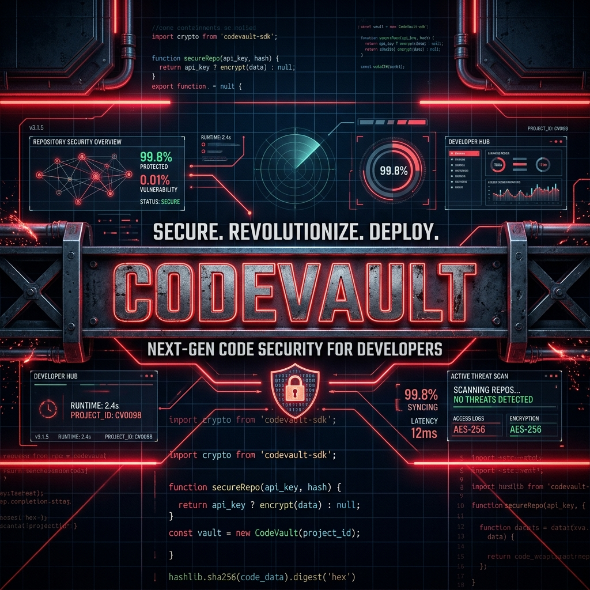
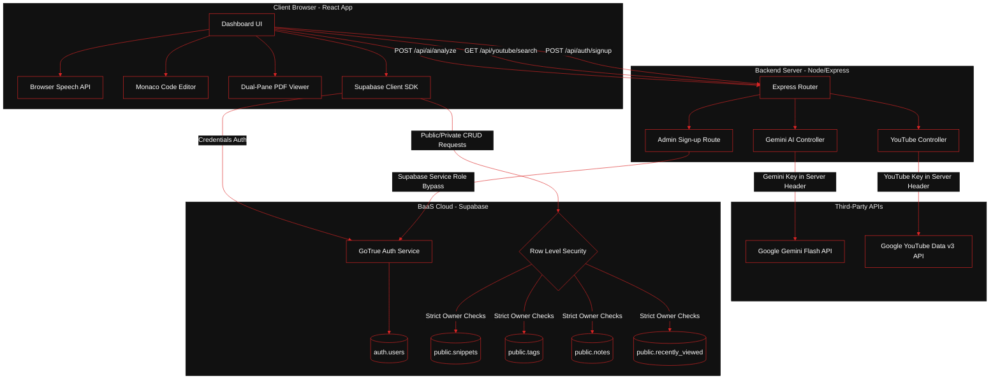
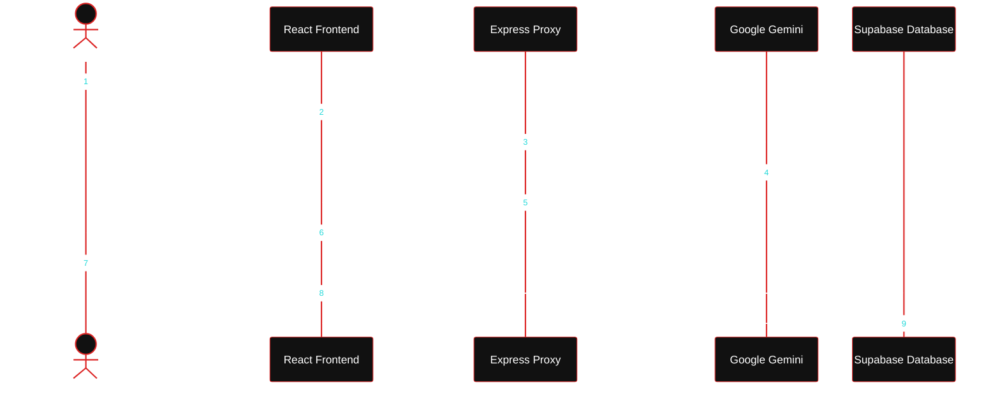
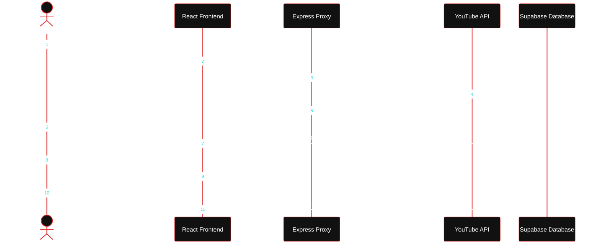

<p align="center">
  
</p>

<p align="center">
  <strong>An industrial-grade, high-performance developer workspace and knowledge base. Securely organize code, automate intelligence, and accelerate continuous learning.</strong>
</p>

<p align="center">
  
  
  
  
  
  
  
</p>

---

## 🏗️ System Architecture

CodeVault utilizes a hybrid **Serverless Direct + Secure Proxy API Gateway** architecture. This separates low-latency storage operations from sensitive, key-bound API operations.



---

## 📋 Project Modules & Structure Matrix

| Module | Frontend Component / Page | Express Router / Controller | Database Table | Description |
| :--- | :--- | :--- | :--- | :--- |
| **Authentication** | [LoginPage.tsx](file:///Users/apple/Desktop/PROJECTS/codevault-hackathon-starter_1/codevault/frontend/src/pages/LoginPage.tsx)<br>[SignupPage.tsx](file:///Users/apple/Desktop/PROJECTS/codevault-hackathon-starter_1/codevault/frontend/src/pages/SignupPage.tsx) | [auth.js](file:///Users/apple/Desktop/PROJECTS/codevault-hackathon-starter_1/codevault/backend/src/routes/auth.js) | `auth.users`<br>`public.profiles` | Authenticates users and creates database profiles. Signups are managed via the backend service role key to auto-confirm users and guarantee username uniqueness. |
| **Snippet Vault** | [DashboardPage.tsx](file:///Users/apple/Desktop/PROJECTS/codevault-hackathon-starter_1/codevault/frontend/src/pages/DashboardPage.tsx)<br>[SnippetForm.tsx](file:///Users/apple/Desktop/PROJECTS/codevault-hackathon-starter_1/codevault/frontend/src/components/SnippetForm.tsx) | *Bypassed (Direct Client SDK)* | `public.snippets`<br>`public.tags`<br>`public.snippet_tags` | The primary workspace featuring the Monaco editor for saving, updating, and managing code blocks. |
| **Explore Hub** | [ExplorePage.tsx](file:///Users/apple/Desktop/PROJECTS/codevault-hackathon-starter_1/codevault/explore) | *Bypassed (Direct Client SDK)* | `public.snippets` | Lists public-facing code templates (`is_public = true`) shared by the global developer community. |
| **AI Assistant** | [Chatbot Interface](file:///Users/apple/Desktop/PROJECTS/codevault-hackathon-starter_1/codevault/frontend/src/components/SnippetForm.tsx#L79-L84) | [ai.js](file:///Users/apple/Desktop/PROJECTS/codevault-hackathon-starter_1/codevault/backend/src/controllers/ai.js) | *No Persistence* | Analyzes snippets, suggests titles/descriptions, and performs automated tag extraction using Google Gemini. Includes native browser dictation support. |
| **Learning Zone** | [LearningZone.tsx](file:///Users/apple/Desktop/PROJECTS/codevault-hackathon-starter_1/codevault/frontend/src/pages/LearningZone.tsx) | [youtube.js](file:///Users/apple/Desktop/PROJECTS/codevault-hackathon-starter_1/codevault/backend/src/controllers/youtube.js) | `public.recently_viewed` | Educational video search index that filters and displays YouTube playlists. Persists video history records in real-time. |
| **Document Vault** | [NotesPage.tsx](file:///Users/apple/Desktop/PROJECTS/codevault-hackathon-starter_1/codevault/frontend/src/pages/NotesPage.tsx) | *Bypassed (Direct Client SDK)* | `public.notes` | Dual-pane interface layout containing a PDF renderer and markdown notes pad for system design and architecture drafting. |

---

## 🔄 Interactive Core Workflows

### 1. Snippet Insertion & AI Enrichment Flow
When a developer inserts raw code inside CodeVault:
1. The client sends the raw text payload to the Express Proxy Server.
2. The proxy routes it to the **Google Gemini Flash API** with strict JSON schemas.
3. Gemini processes the syntax and generates a structured analysis (Title, Description, Language, Tags).
4. The client uses the response to pre-populate metadata before storing the record securely in PostgreSQL via Supabase.



---

### 2. Learning Zone & Documentation Drafting Flow
Developers can study tutorials and document complex system specifications in parallel:
1. Search queries are sent through the YouTube proxy API, which automatically restricts searches to educational keywords.
2. Selected video details are logged in the database (`recently_viewed`) to maintain history streaks.
3. Developers upload system-design PDFs and read them side-by-side with a persistent Markdown editor, which automatically syncs text updates to the `notes` table.



---

## 🔒 Security & Data Integrity Protocol
CodeVault enforces security directly in the database layer via **Row Level Security (RLS)** in [PRODUCTION_SCHEMA.sql](file:///Users/apple/Desktop/PROJECTS/codevault-hackathon-starter_1/codevault/PRODUCTION_SCHEMA.sql):

### Row Level Security Policies:
*   **public.snippets:** Accessible by any authenticated user for reading (enables the "Explore" dashboard). Mutating (INSERT, UPDATE, DELETE) is restricted to users whose `auth.uid() = user_id`.
*   **public.tags & public.notes:** Isolated per user. No cross-user access allowed.
*   **public.recently_viewed:** Locked down. Users can only fetch and update their own video logs.

### Anti-Spoofing Triggers:
Every database mutation in `snippets`, `tags`, `notes`, and `snippet_tags` fires the `handle_set_user_id` trigger before running. If the client tries to set a different `user_id` than their actual authenticated session UID (`auth.uid()`), the trigger throws an exception:
```sql
CREATE OR REPLACE FUNCTION public.handle_set_user_id()
RETURNS TRIGGER AS $$
BEGIN
  IF NEW.user_id IS NULL THEN
    NEW.user_id := auth.uid();
  ELSIF NEW.user_id != auth.uid() THEN
    RAISE EXCEPTION 'Unauthorized: Cannot set user_id to different user';
  END IF;
  RETURN NEW;
END;
$$ LANGUAGE plpgsql SECURITY DEFINER;
```

---

## 🚀 Installation & Local Launch

### 📋 Prerequisites
*   Node.js (v18.x or higher)
*   A free **Supabase** account
*   Google Gemini API Key
*   YouTube Data v3 API Key

### 1. Project Setup
```bash
git clone https://github.com/jaggureddy11/Code-Vault.git
cd Code-Vault
npm run install:all
```

### 2. Database Sync
Go to your **Supabase Project Dashboard** → **SQL Editor** → Paste and run [PRODUCTION_SCHEMA.sql](file:///Users/apple/Desktop/PROJECTS/codevault-hackathon-starter_1/codevault/PRODUCTION_SCHEMA.sql).

### 3. Setup Configuration
Create environment files on both directories:

#### Frontend (`codevault/frontend/.env.local`):
```env
VITE_SUPABASE_URL=https://your-project-id.supabase.co
VITE_SUPABASE_ANON_KEY=your-supabase-public-anon-key
VITE_API_URL=http://localhost:3000
```

#### Backend (`codevault/backend/.env`):
```env
PORT=3000
SUPABASE_URL=https://your-project-id.supabase.co
SUPABASE_SERVICE_KEY=your-supabase-service-role-key
GEMINI_API_KEY=your-google-gemini-key
YOUTUBE_API_KEY=your-youtube-data-api-key
```

### 4. Running the Stack
Run both servers concurrently:
```bash
npm run dev
```
Open **`http://localhost:5173`** to access the dashboard.

---

## 🚢 Production Deployment

### 1. Build Client Assets
Compile the optimized production assets of the React application:
```bash
npm run build
```

### 2. Deploy Frontend (Static)
Deploy the compiled client bundle `/frontend/dist` directly to Firebase Hosting:
```bash
firebase deploy
```

### 3. Deploy Express Backend Server
Deploy the `/backend` folder to Render or Railway. 

> [!IMPORTANT]
> Once deployed, copy the server domain (e.g. `https://your-backend.railway.app`) and set it as `VITE_API_URL` in the frontend `.env.local` file. Re-run `npm run build` and redeploy the frontend so that the application points to your live server instead of localhost.

---

## ❓ Frequently Asked Questions & Troubleshooting

<details>
<summary><b>Why am I getting "Error: Failed to fetch" when attempting to sign in?</b></summary>
<p>
This is typically caused by local privacy extensions or browsers (like Brave) blocking outgoing connections to <code>*.supabase.co</code> because they mistake them for third-party tracking scripts. 
</p>
<p>
<b>Solution:</b> Whitelist or turn off shields for your domain in your browser, or sign in using an Incognito/Private window.
</p>
</details>

<details>
<summary><b>Why are the "AI Suggest" and "Learning Zone" search features returning errors on my deployed hosting site?</b></summary>
<p>
Because Firebase Hosting only hosts the static frontend build. If your <code>VITE_API_URL</code> environment variable points to <code>http://localhost:3000</code> or is not configured, the frontend cannot talk to your backend Express server.
</p>
<p>
<b>Solution:</b> Deploy your backend server to a cloud hosting provider (e.g. Railway or Render), copy the live URL, set it as <code>VITE_API_URL</code> in your frontend config, and redeploy.
</p>
</details>

<details>
<summary><b>How do I customize the brutalist visual elements or standard coloring?</b></summary>
<p>
You can edit the Tailwind CSS tokens or color scheme parameters in <code>frontend/src/index.css</code>. The typography and standard alignment elements are styled using <code>JetBrains Mono</code> and high-contrast styling tokens.
</p>
</details>

---

<p align="center">
  <i>CodeVault © 2026 — Designed for high-velocity software engineering.</i>
</p>
