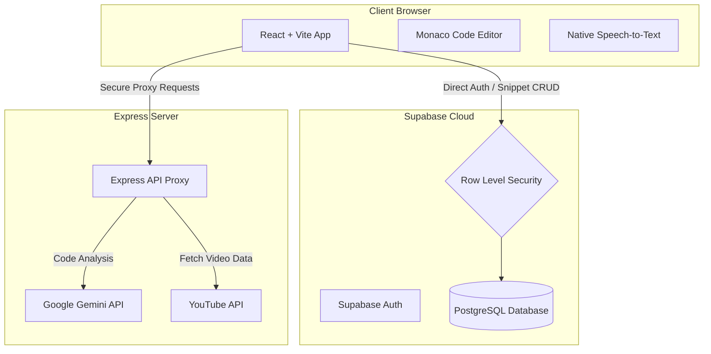

# <p align="center"><br/>🦾 CODEVAULT</p>

<p align="center">
  <strong>Your AI-powered secure engineering brain. Centralize logic, eliminate context switching, and accelerate continuous learning.</strong>
</p>

<p align="center">
  
  
  
  
  
  
  
</p>

---

## 🏗️ Technical Architecture

CodeVault uses a high-performance **Jamstack + Secure Proxy** architecture:
*   **Direct BaaS Connection:** High-speed CRUD operations on snippets, notes, and profiles are executed directly from the client browser to **Supabase** (secured by strict Row Level Security).
*   **Secure API Proxy:** AI analysis (Google Gemini) and third-party integrations (YouTube Search) are proxied through a **Node.js + Express** server to protect secret keys from exposure.



---

## 🦾 Core Modules

### 1. CodeVault AI: Intelligent Code Analyzer
The core intelligence engine. Select any code snippet and let the AI tutor:
*   **Autotagging:** Instantly detects the language and suggests 3-5 relevant tags.
*   **Explanations:** Summarizes complex architectural patterns into direct, actionable explanations.
*   **Language Auto-Detection:** Seamlessly identifies code snippets across 100+ programming languages.

### 2. Native Voice Mode (Speech-to-Code)
Stop typing and dictate code block structures:
*   **Zero-Lag Capture:** Uses native browser speech-to-text APIs.
*   **Contextual Insertion:** Dictate requirements, notes, or logic changes straight into the chat assistant.

### 3. Integrated IDE Dashboard
*   **Monaco Editor Integration:** Enjoy the exact same editing engine that powers VS Code (minimap, auto-formatting, and intelligent cursor triggers).
*   **Brutalist "Gritty Industrial" UI:** A beautiful, high-contrast dark theme optimized for developer focus, using **JetBrains Mono** typography.
*   **Document Vault:** Upload, view, and read PDFs side-by-side with Markdown note-taking pads.

### 4. Interactive Learning Zone
Search, filter, and pin programming tutorials from YouTube inside a dedicated, distraction-free player frame.

### 5. Momentum Protocol Tracker
A 7-day brute grid schedule to manage sprint cycles, track focus habits, and maintain streaks with local storage persistence.

---

## 🚀 Getting Started

### 📋 Prerequisites
*   Node.js (v18.x or higher)
*   A free **Supabase** account
*   Google Gemini API Key (or OpenAI API Key)

### 1. Clone the Codebase
```bash
git clone https://github.com/jaggureddy11/Code-Vault.git
cd Code-Vault
```

### 2. Install Project Dependencies
Use the unified workspace script to install package files for both frontend and backend:
```bash
npm run install:all
```

### 3. Setup Database Schema
1. Go to your **Supabase Dashboard** → **SQL Editor** → **New query**.
2. Copy the contents of the SQL file [PRODUCTION_SCHEMA.sql](file:///Users/apple/Desktop/PROJECTS/codevault-hackathon-starter_1/codevault/PRODUCTION_SCHEMA.sql) and paste them into the SQL editor.
3. Click **Run** to set up the database tables, indices, RLS policies, and automated user-profile triggers.

### 4. Configure Environment Secrets
Create a `.env` file in the backend directory and a `.env.local` file in the frontend:

#### Frontend Config:
Create `codevault/frontend/.env.local`
```env
VITE_SUPABASE_URL=https://your-project-id.supabase.co
VITE_SUPABASE_ANON_KEY=your-supabase-public-anon-key
VITE_API_URL=http://localhost:3000
```

#### Backend Config:
Create `codevault/backend/.env`
```env
PORT=3000
SUPABASE_URL=https://your-project-id.supabase.co
SUPABASE_SERVICE_KEY=your-supabase-service-role-key
GEMINI_API_KEY=your-google-gemini-key
YOUTUBE_API_KEY=your-youtube-data-api-key
```

> [!CAUTION]
> **Keep your `SUPABASE_SERVICE_KEY` and `GEMINI_API_KEY` private.** 
> Never expose the `.env` file in front-end deployments or commit it to GitHub.

---

## 🛠️ Development & Production Commands

### Start Local Development Servers
Starts the Vite dev server (on port `5173`) and the Express proxy (on port `3000`) simultaneously:
```bash
npm run dev
```

### Build & Serve for Production
Compile the optimized static build of the frontend and serve it through the Express proxy server:
```bash
# Compile and build both client & backend
npm run build

# Start production server
npm run start
```

---

> [!IMPORTANT]
> **Security Configuration:** 
> CodeVault enforces strict Row Level Security (RLS) policies on all client tables. Your snippets, notes, and records are strictly private and accessible only by you, unless explicitly marked as **Public**.

---

<p align="center">
  <i>Built for DeveloperWeek 2026. Made with ❤️ by developers, for developers.</i>
</p>
